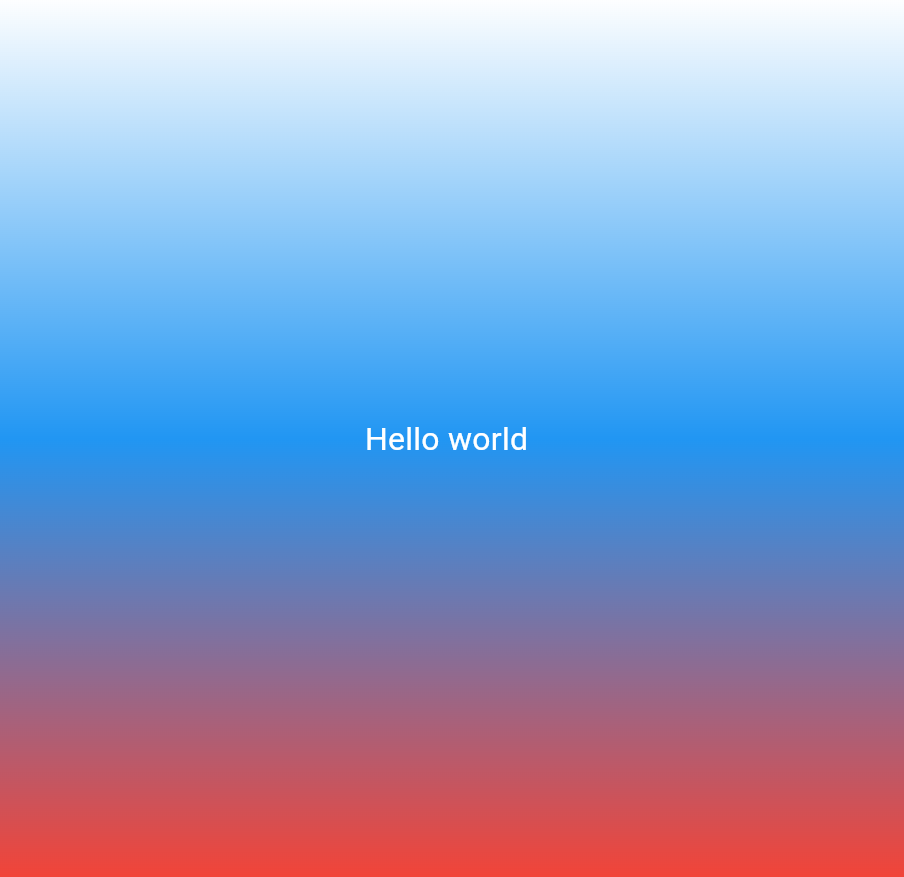

# Лабораторная работа №3. Знакомство с Flutter

Первое  веб-приложение на  Flutter, демонстрирующее работу  проекта, базовыми виджетами и кастомизацией интерфейса.

## Автор
- **Студент:** Истомин Максим Алексеевич
- **Группа:** ИСП-243

## что использовалось:
- **Flutter:**
- **Dart:**
- **браузер:** adge
- **IDE:** VS Code

## Скриншот приложения


## Как запустить

1. Клонировать репозиторий:
   ```
   git clone https://github.com/krekerfit1/flutter_lab3.git
   ```
2. Перейти в папку проекта::
   ```
   cd first_flutter_app
   ```
3. Установить зависимости(скачивает и устанавливает все сторонние библиотеки и пакеты прописанные в конфигурационном файле):
   ```
   flutter pub get
   ```
4. Запустить приложение в браузере :
   ```
   flutter run -d 'установленный браузер'
   ```
---
   ## Что изучили:

    - Познакомились со структурой проекта Flutter и базовыми концепциями.

    - Освоили механизмы Hot Reload и Hot Restart, а также работу с инструментами отладки Flutter DevTools, Flutter Inspector Flutter docktor.

    - Изучили работу виджетов: MaterialApp, Scaffold, Container, Center, Text.

    - Настроили стилизацию текста и градиентный фон .